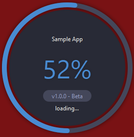

# Circular Splash Screen for Qt(C++)

This was originally created in PySide by @Wanderson-Magalhaes in a tutorial video.

The Splash Screen looked interesting to me and so I ported it to C++ in a reusable format.

Hope it helps someone who's looking for a good splash screen for their application. Licensed under BSD-2 Clause.

## How it looks
